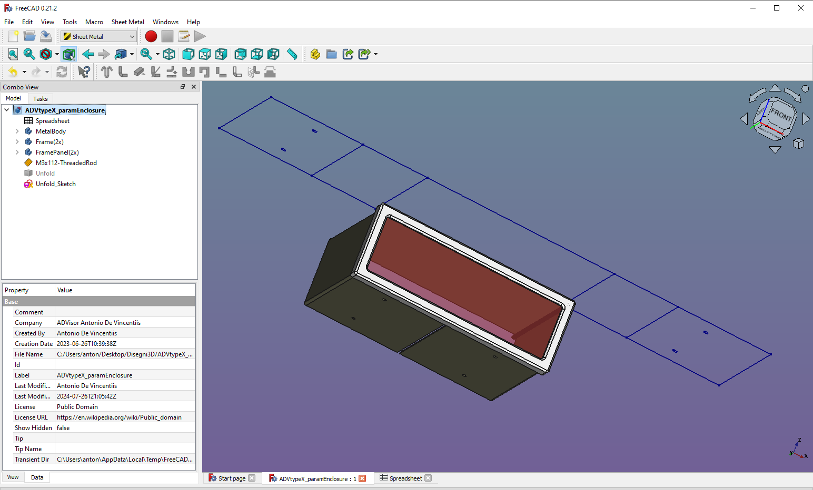
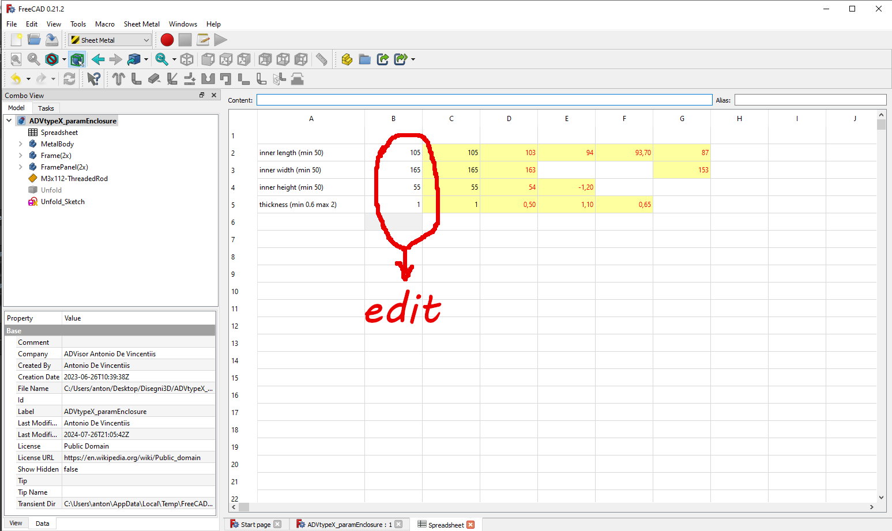

# ADV Type X FreeCAD Parametric Electronics Enclosure 
FreeCAD Parametric Electronics Enclosure, composed of a sheet metal with 4 folds, 2 frames and 2 perforated panels (front-back).
The latter can be made of different materials according to aesthetic needs.
Front and back panels are join trought 4 threaded rods
(Designed with FreeCAD 0.21)

*FreeCAD view with unfold sheet metal*

*Parameter Spreadsheet*

Edit the parameters in the FreeCAD spreadsheet to get the correct inner size for the enclosure.

