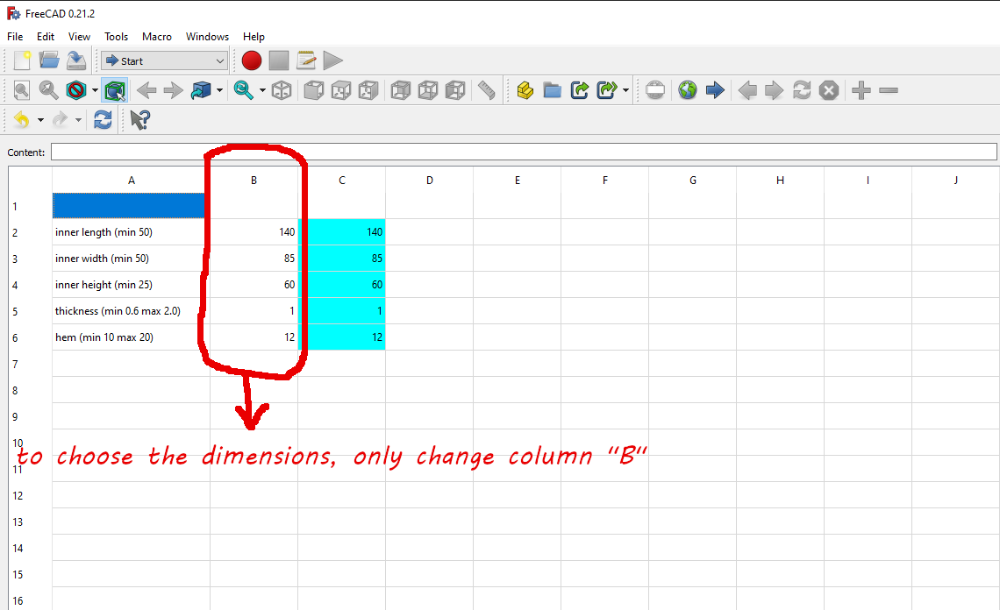
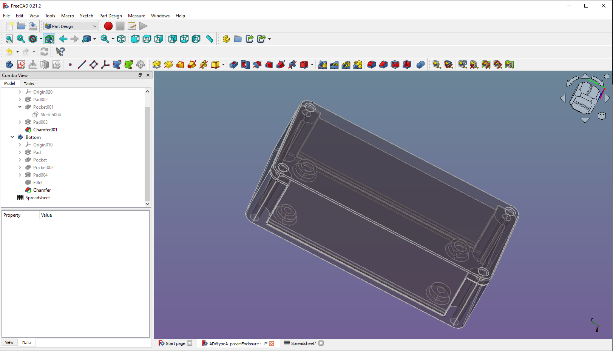
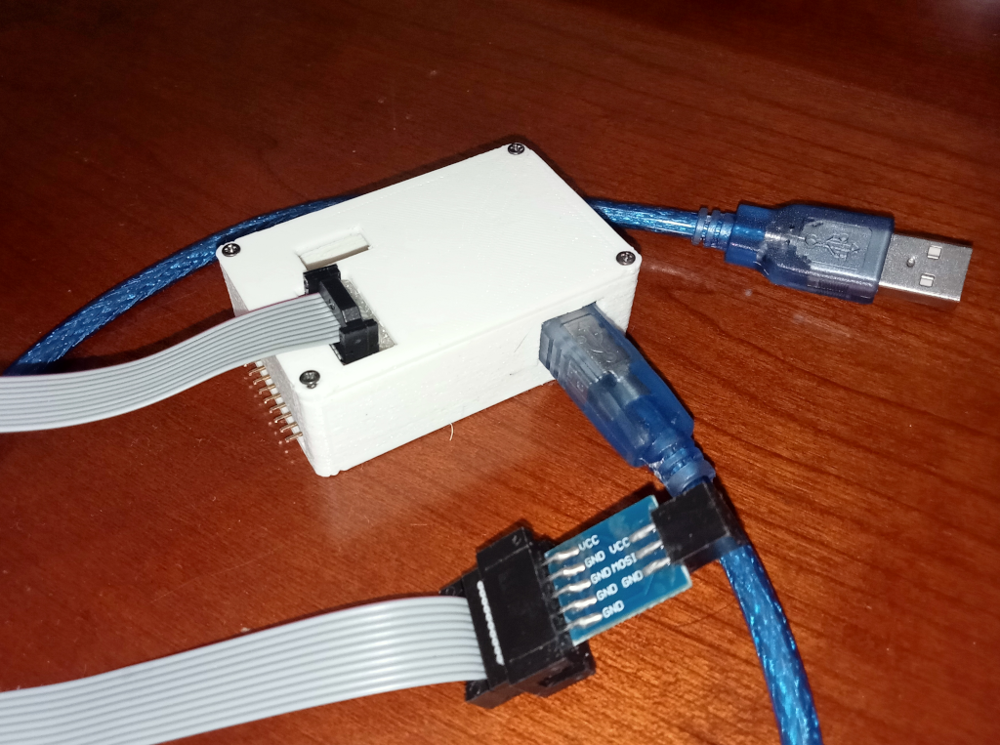
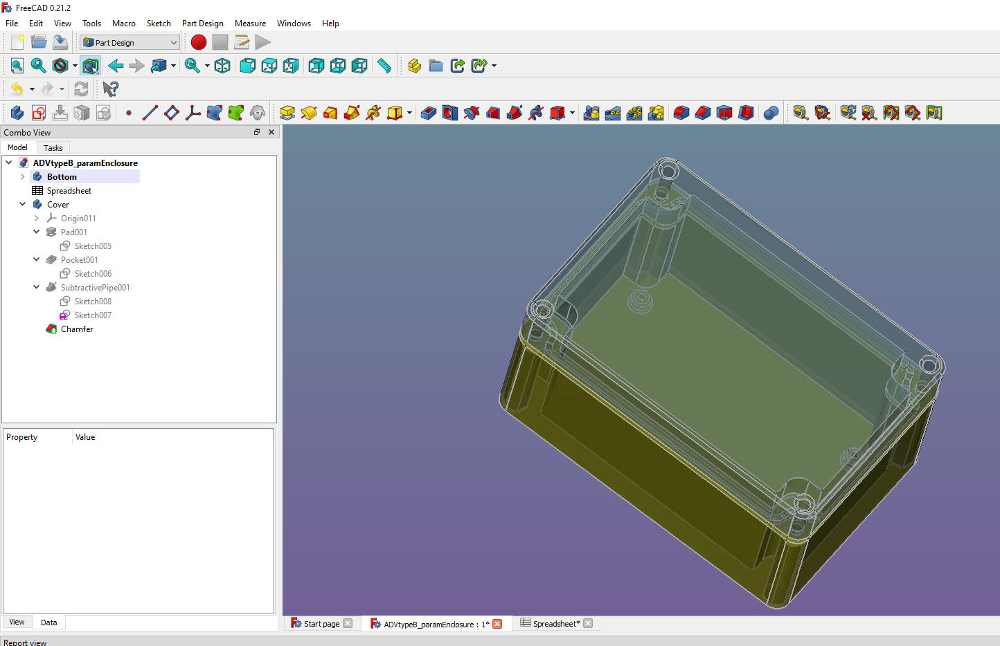
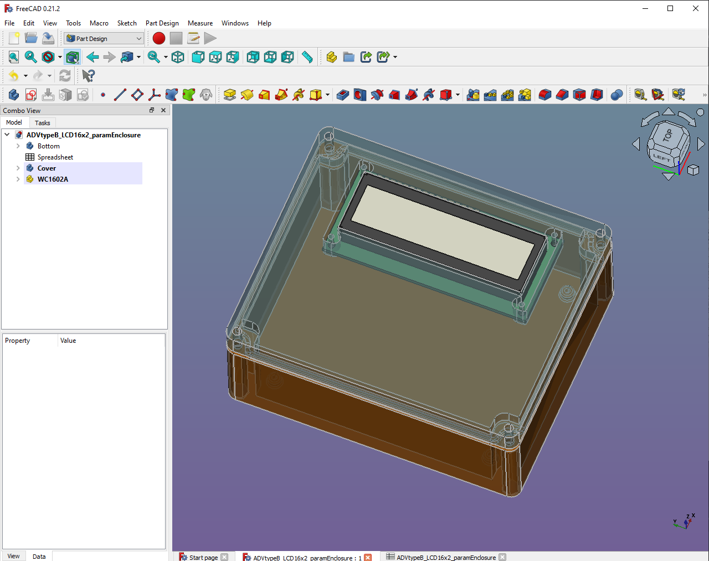
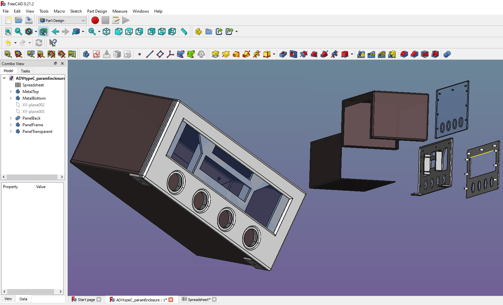
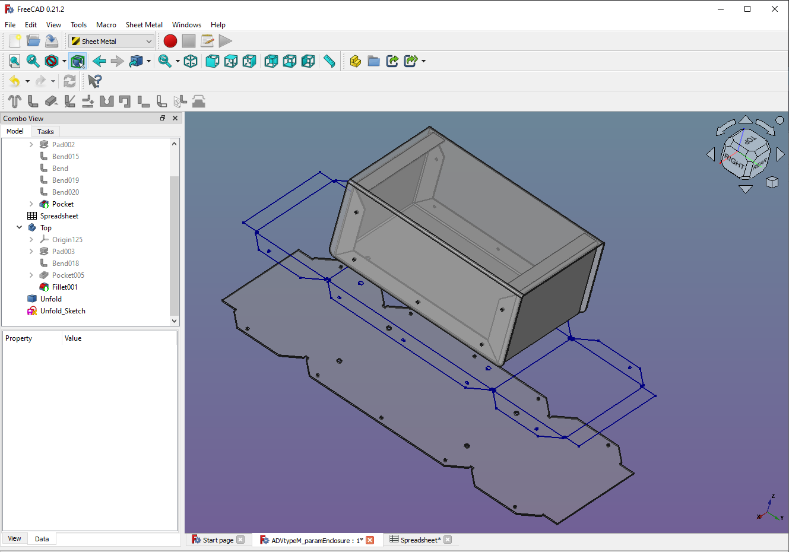
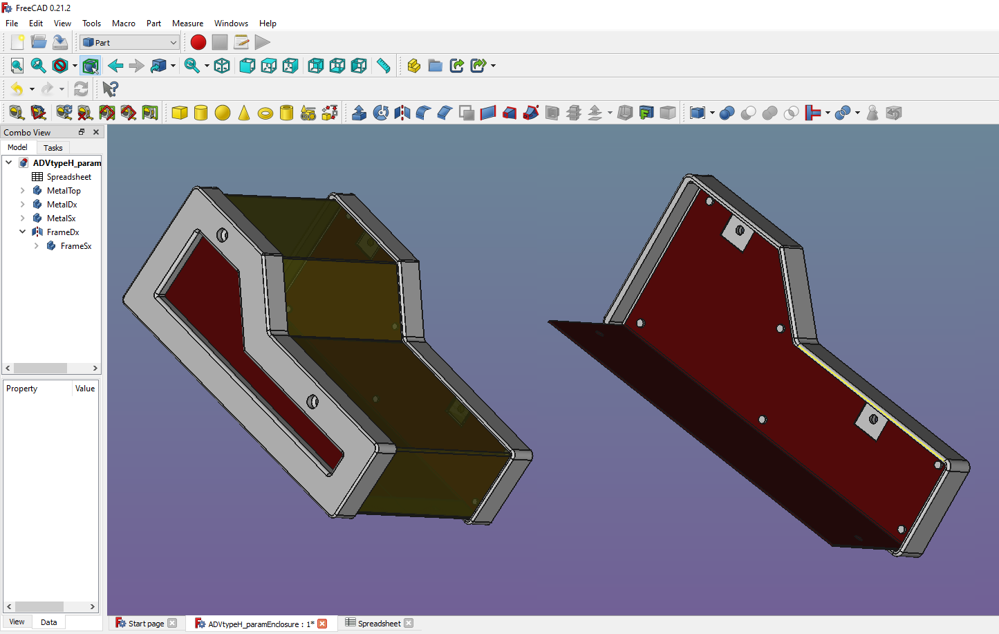
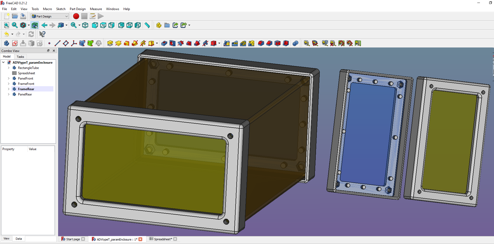

# ADV Parametric Electronics Enclosure made with FreeCAD
Electronics enclosures with parameterized dimensions.
This enclosures serve as a base to most electronic containers I create.
(Designed with FreeCAD 0.21)

## Choice of size
### To choose the dimensions, only change column "B" of the spreadsheet

*Edit the parameters in the FreeCAD spreadsheet to get the correct size.

> :warning: **Warning! In some drawings you may encounter errors when resizing: try to do it in 5-10 mm steps**

## Type A (FreeCAD)

### Two "U" plastic elements screwed by 2.2 mm self-tapping screw

*Type A view*

*Type A after some cutout windows, a small example to protect an old AVRISP mySmartUSB MK2*

## Type B (FreeCAD)

### Two plastic elements screwed by 4 M3 bolts, with or without 16x2 LCD display
The container includes a channel as a seat for a rubber gasket, if you don't have a suitable one and don't need a high level of airtightness you can also use an electrical wire of the right diameter (this is also parameterized).

*Type B view*

*Type B with LCD 16x2 cutout windows*

## Type C (FreeCAD with Sheet Metal add-on)

### 2 sheet metal elements, 2 plastic elements (frame and mounting plate) and 1 transparent panel screwed by by 2.2 mm self-tapping screw.
Container made using two sheet metal, and tree plastic elements (one could be transparent as picture frame), remelted pegs for joined with top metal.

*Type C views*

## Type M (FreeCAD with Sheet Metal add-on)

### Two sheet metal elements screwed by 2.2 mm self-tapping screw.
After resizing with the spreadsheet you will be able to export the sheet metal unfold to vector format for practical creation.

*Type M view*

## Type H (FreeCAD with Sheet Metal add-on)

### Handheld or sloped console enclosure. Tree sheet metal elements and 2 plastic frame screwed by 2.2 mm self-tapping screw.
After resizing with the spreadsheet you will be able to export the sheet metal unfold to vector format for practical creation.
Remelted the pegs for joint frames and lateral sheets.

*Type H views*

## Type T (FreeCAD)

### One rectangular tube, 2 plastic frames and 2 panels screwed by 4 M3 threaded rod and nuts.
Container made using a rectangular tube, two panels (one could be transparent) and two 3D printed frames joined to the panels with remelted pegs.

*Type T views*
